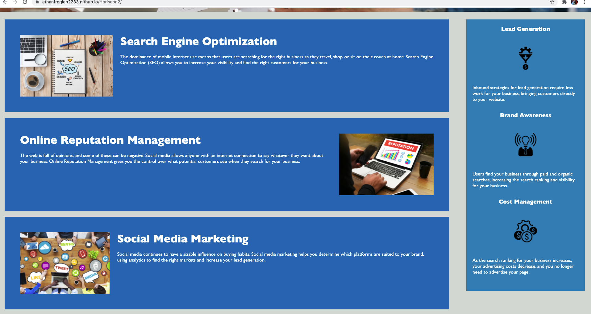

# Code Refactor Starter Code

https://ethanfregien2233.github.io/Horiseon2/
https://github.com/ethanfregien2233/Horiseon2

For this project, I took existing code for the horiseon website and refactored it to add accessibility features to the images, as well as consolidated redundant code to keep the interface clean well into the future.